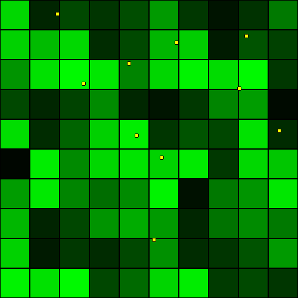

[](https://pharo.org/download)

[](https://raw.githubusercontent.com/cormas/cormas/master/LICENSE)


# re:mobidyc
reːmobidyc (or ReMobidyc without an exotic punctuation letter) is a web-based multi-agent simulator for individual-based modeling in population dynamics and ecotoxicology.

## Installation

Re:mobidyc is implemented on the [Pharo](https://pharo.org/) system.
There are three ways to install re:mobidyc.

### 1. from command shell

The following one-liner will download Pharo and install re:mobidyc.

```
curl https://raw.githubusercontent.com/ReMobidyc/ReMobidyc/main/scripts/install-remobidyc.sh | bash
```

### 2. from Pharo

If you have the [Pharo](https://pharo.org/) installation, you can install re:mobidyc by evaluating the following expression.
(Open a Playground by the Browse>>Playground menu in the menubar, then copy&paste the text below into the Playground. Select all the pasted text and select the "Do-it" in the right-click menu.)

```
EpMonitor disableDuring: [
	Metacello new
		onConflictUseLoaded;
		onWarningLog;
		repository: 'github://ReMobidyc/ReMobidyc:main/';
		baseline: 'ReMobidyc';
		load ] 
```

### 3. from binary package

The following pre-built packages are available.

* [macOS / AppleSilicon](https://github.com/ReMobidyc/ReMobidyc/releases/download/preview-5/remobodyc-mac-arm64.dmg)
* [macOS / Intel processor](https://github.com/ReMobidyc/ReMobidyc/releases/download/preview-5/remobidyc-mac-x64.dmg)
* [Linux / Intel processor](https://github.com/ReMobidyc/ReMobidyc/releases/download/preview-5/remobidyc-linux-x64.zip)
* [windows64 / Intel processor](https://github.com/ReMobidyc/ReMobidyc/releases/download/preview-5/remobidyc-win-x64.zip)

## Modeling Language

Documentation is still under construction. Please see the following "cheatsheets".

* [Expressions](docs/cheatsheets/expressions.md)
* [Units](docs/cheatsheets/units.md)

## Examples

### 1. Simplified SugarScape


Each cell grows grass (indicated by green rect) and each goat (yellow dot) eats grass.
This example exhibits the interaction between an animat and the cell where the animat is located.

### 2. Goat and Wolf


Each cell grows grass (indicated by green rect), each goat (yellow dot) eats grass and each wolf (red dot) preys on its nearest goat.
This example exhibits the interaction between two animats.

### 3. Grasshopper


Each cell grows grass(indicated by green rect), a grasshopper (yellow dot) eats grass.
When a grasshopper is matured by age, it lays 5 eggs (cyan dots), and each egg hatches in 20 days.
This example exhibits life stages of individuals.

[A tutorial](Tutorials/Grasshoppers/Grasshoppers.md) to build this Grasshopper model is available.

## Background
Re:Mobidyc is a variation of Mobidyc that inherits the design rationale
of Mobidyc.
The objective of Re:Mobidyc is to renovate the original Mobidyc keeping
its design principles.
The base system is changed from VisualWorks to Pharo.
They are both Smalltalk systems, and Pharo is today's most actively
developed/used open-source Smalltalk system.
We will renovate the implementation of Mobidyc from its very basis to
apply outcomes from computer science.
The development of Re:Mobidyc is just beginning, and we will need time
to re-produce the functionality of the original Mobidyc.

[1] [The original Mobidyc site](https://mobidyc.cnrs.fr/index.php?title=English_summary)

## Design Rationale
As a tool for scientific research, ReːMobidyc will provide the following features

* Easy to model
  - A behavior of an agent will be defined in a declarative manner instead of series of commands, if-statements and loops.

* Easy to modify
  - Every component in a behavioral definition will be type-checked so that the user can find minor errors before running it.

* Easy to verify model
  - A definition can have assertions that double-checks its behavior so that the user can be sure that the model is defined as intended.

* Easy to reproduce
  - ReːMobidyc will make all simulation reproduceable including randomized actions.

* Easy to verify output
  - States of agents at every step in simulation will be stored in persistent memory so that the user and reviewers can check its validity.

* Easy to trace
  - The user can trace which agent had interaction with a particular agent to find the cause of an observed phenomenon. 

* Easy to publish
  - The user can publish her/his model along with input/intermediate/output data and visualized images as an evidence in scientific research.

* Easy to implement
  - ReːMobidyc will define its own modeling language in formal specification language so that its execution engine can be implemneted by third persons with complete compatibility.

## Architectural design
To achieve the objectives above, ReːMobidyc will have the following major components.

* Persistent storage
  - ReːMobidyc will use a DBMS as its persistent storage to store models, states of agents at all simulation steps, input data and output data.

* Reproducible random numbers
  - ReːMobidyc will have its own random number generator and make its code open so that all actions taken in a simulation can be accurately reproduceable.

* Web servers and APIs
  - ReːMobidyc will have web-based UI so that models can be shared by research communities.
  - ReːMobidyc will provide web API to retrieve models and simulation data so that anyone can create specialized native applications.

## Organizational Contributors
The re:mobidyc project is supported by [DGtal Aqua Lab, Shizuoka University](https://wwp.shizuoka.ac.jp/dgtalaqualab/) and [Software Research Associates, Inc.](https://www.sra.co.jp/en/)

[](https://wwp.shizuoka.ac.jp/dgtalaqualab/)　　[](https://www.sra.co.jp/en/)
