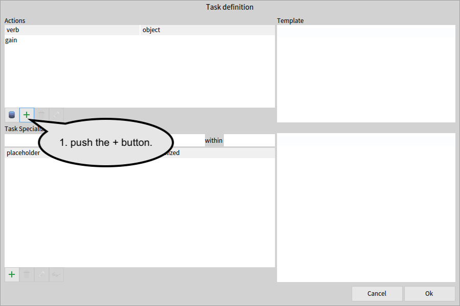
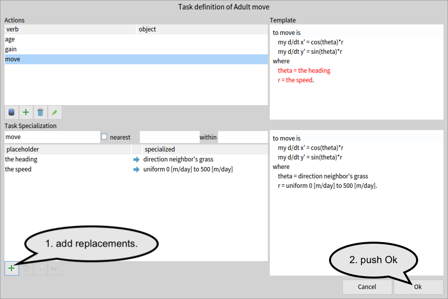
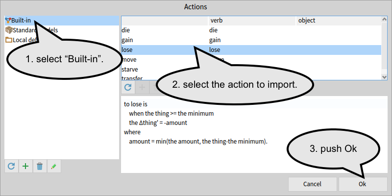
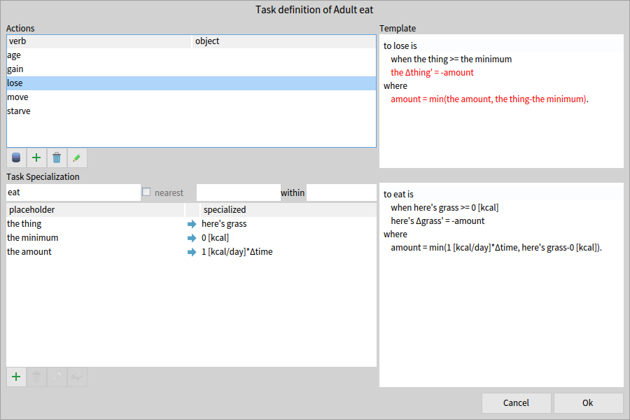
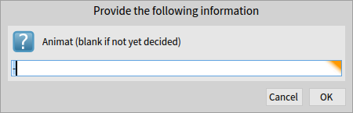
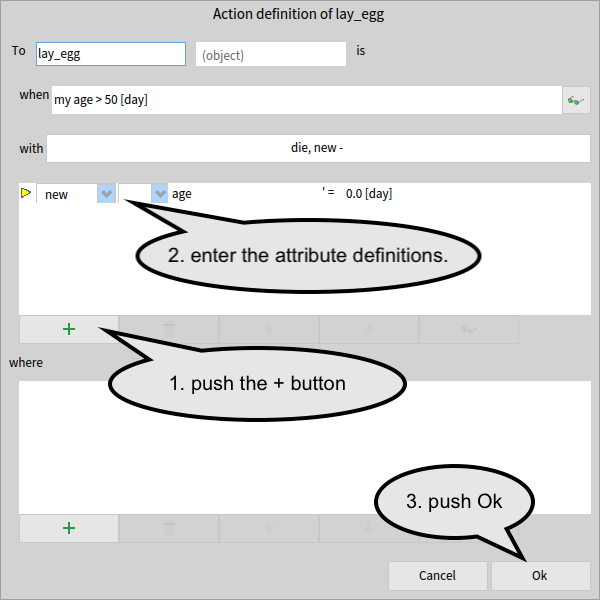
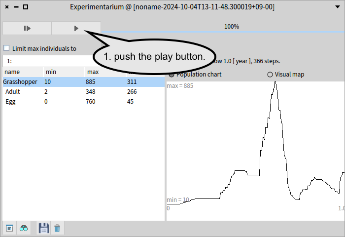

# Build a simple Grashoppers model

This tutorial guides you to build a simple model with lifehisotry stages.


## 1. Open a modeler

In the menu bar, find "re:Mobidyc" menu to select "Modeler (GUI)".


## 2. Define Patch

We want grasshoppers fly to rich grass, so in this model each patch has the amount of grass as an attribute.
The unit of amount could be expressed in weight (such as `kg`), height (such as `cm`), or some other units.
In this model, we consider it's nutrition and use `kcal` to measure the amount of grass.

### the grass attribute

Select the 'Patch' tab in the modeler to edit the definition of Patch.

The attribute definitions of the Patch agent is listed in the upper left list of the Patch page.
The list is initially empty because Patch initially has no attribute.
We will add the `grass` attribute to Patch.

First, click the green '+' button below the attribute list to add a new definition.
The newly added definition is empty and incomplete as indicated by the red triangle at the head column of the row.
Enter 'grass' into the name column, `kcal` to the unit column, and `uniform 0 [kcal] to 100 [kcal]` to the initial value column.

The Patch definition page will look as below.


### visualization

We want to visualize the amount of grass during the simulation.
The visualization can be set at the Visualization section of the Patch definition page.

Fill in `my grass` after the "with alpha =" label, and `0 [kcal]` and `100 [kcal]` into the following fields.
This visualization renders each patch with green blended with black background proportional to the patch's `grass` attribute.
When the grass is `0 [kcal]` the patch will look black, and `100 [kcal]` will color the patch in fully green.


## 3. Define Grasshopper as a species with Adult and Egg stages

This model exhibits grasshoppers lay eggs and eggs become adults by hatching.
Adult and Egg are life-history stages and are both modeled as Animat.

### Adult animat

Selecting the green '+' tab will bring you the new animat page.
Type `Grasshopper` as the new species name and `Adult` as the stage name.
Then, press the green '+' button on the right to create a new animat named `Adult`.


### age attribute of Grasshopper

The `Grasshopper` tab brings you the definition page of the Grasshopper animat.
To judge maturity of grasshopper to lay eggs, we define the `age` attribute of the Grasshopper animat.


Pressing the green "+" button below the Attribute list and type `age` in the name column, `[day]` in the unit column, and `0 [day]` in the initial value column to define the `age` attribute.


### Egg animat

We also need the `Egg` stage of the `Grasshopper`.
To create a new stage of an existing species, select the '+' tab within the Grasshopper page, and enter the new stage name and then push the '+' button.


### age attribute of Egg

Again, define the `age` attribute in the same way as the one in `Grasshopper` animat.


### visualization of Animats

You can choose how to visualize the animat.
Select cyan in the Visualization section at the right top part of the `Egg` definition page.


## 4. Define the "grow" task of Patch

Now we are at the very core part of the model to define the behavior of each agent.
In re:mobidyc, the behavior of an agent is defined by tasks.
A task of an agent is tyically definitions of changes to properties of the agent, the patch where the agent is on, and optionally other agents within a given range.
For example, the `grow` task is to increase the value of the `grass` attribute of a patch.

Clicking at the green "plus" button below the Task list, the task definition browser will open.


### the "gain" action

To define a new task, we take two steps: (1) select or define an action, and then (2) specialize the action by providing the context of the situation to perform the task.
A task is a sentense in the form of either *subject-verb* or *subject-verb-object*.
In the case of the `grow` task of the Patch, the sentence is `Patch grow`.

We have already defined the subject `Patch`.
We will define the verb `grow` using the pre-built verb `gain` because to grow grass is to gain the amount of grass.
An action is a generalized template of the task.
Clicking at the repository button, the repository browser for actions will open.


Select `built-in` in the repository list on the left, and then `gain` in the upper-right list.
The source definition will be shown below the list.


`the` denotes placeholders which will be replaced later in the definition of tasks.
This action contains three placeholders: `the thing`, `the maximum`, and `the amount`.

The line `when the thing < the maximum` declares the condition to perform this action.
If this condition is not satisfied, tasks based on this action will not be performed.

`the Δthing' = amount` defines the main effect of this action that the value of `the thing` will be increased by `amount`.
The value of `amount` is defined in the `where` clause.

### the "grow" task

The task specialization section is at the left-bottom of the task definition browser.
The `grow` task can be defined as a specialization of the `gain` action by replacing the placeholders.
When the generic action is specified, the action name is used as the verb by default.
We can first correct the verb to `grow` as it is the name of the task.

All the placeholders should be replaced with specific expressions in order to make the task executable.
The green '+' button opens a small dialog to define a new replacement.
Select `the thing` in the left droplist, and enter `my grass` in the right expression field.
Push Ok button to finish a replacement definition.


Add `the maximum -> 100 [kcal]` and `the amount -> 1 [kcal/day] * delta time`.
Please note that if you enter `delta`, the system will translate it into the `Δ` symbol.

The task definition will look as follows.


Press the "OK" button and then the Patch definition page will look as follows.


## 5. Define tasks of Adult

We will define five tasks of the `Adult` animat, namely `age`, `move`, `eat`, `starve`, and `lay_egg`.

### the "age" task of Grasshopper

We want to manage the maturity of a grasshopper in the `age` attribute.
Although it can be defined as a special case of `gain`, we will define it as a user-defined action at this time.

Select the `Grasshopper` tab and then the `Adult` tab.
Click at the green "+" button at the tasks section to open the task definition browser.
Then, push the "+" button next to the repository button to open an action definition editor.



In the position of `verb`, enter `age` which is the name of the action.
We then define the change definition on the `age` attribute.
Click at the green "+" button ABOVE the `where` label, and then the Attribute definition dialog will open.

Select `my` and Δ in the droplists, and enter `age` and `delta time`.
The `age` action will be defined as follows.


We defined the `age` action very specific to our animat, and the resulting action does not need any specialization.
We simply select the `age` action and press the `OK` button in the task definition browser.


### the "move" task

The `move` task takes a grasshopper to richer field, i.e. the patch with more `grass` attribute.
The re:mobidyc's built-in action repository provides the `move` action that allows you to specify the direction and the speed.
Click at the green "+" button at the task section to open the task definition browser.

First we import the `move` action from the built-in repository.
Click at the repository button at the action section to open the repository action browser, and select the built-in repository and the `move` action.


Then we specialize the `move` action to direct the grasshopper to richer field.
For `the direction`, we use `direction neighbor's grass` that gives the direction of the gradient of the `grass` attribute.
For `the speed`, we use `uniform 0 [m/day] to 500 [m/day]` that gives a random number from the uniform distribution between 0 and 500 m/day.



### the "eat" task

In this mode, the `eat` task consumes the grass in the field.
So, we can define the `eat` task using the `lose` action provided in the built-in repository.

First, select the `Grasshopper` tab and click at the green "+" button at the tasks section to open the task definition browser.
Import the `lose` action using the repository button in the action section.



Then we specialize the `lose` action into the `eat` task.
First, enter `eat` under the Task Specialization label instead of lose.
Then provide the following replacements.

```
the thing -> here's grass
the minimum -> 0 [kcal]
the amount -> 1 [kcal/day] * delta time
```

This will have a grasshopper eat the grass at the rate of 1 [kcal/day] unless the grass is below `0 [kcal]`.
The resulting task definition will look as below.


### the "starve" task

In this model, a grasshopper dies when the field has no food to eat (namely grass).                
The `starve` action is provided in the built-in repository and we can give the following replacements.

```
the vitality -> here's grass
the minimum -> 1 [kcal]
```
The resulting `starve` task will look as follows.



### the "lay_egg" task

Reproduction is not a mere change to properties but generate one or more new individuals into the simulation.
Such actions can be defined using the `new` lifehistory directive.
In this particular model, a grasshopper dies when it lay eggs.
Death can be implemented by the `die` lifehistory directive.

Select the `Adult` stage tab and click at the green "+" button at the tasks section to open the task definition browser.
Clicking at the green "+" button below the Actions list will open an Action definition dialog.
Enter `lay_egg` as the verb.
Because we want an adult grasshopper to lay eggs when the adult is matured enough, we enter the condition `my age > 50 [day]` in the "when" field.


Then press the button labelled `no directive` to choose life-history directives `new` and `die`.


Then we will be asked to enter the Animat name, but leave it as it is and press OK again.



Then, we will finish the remaining part of the `lay_egg` action. 
Although the `age` attribute of a new egg is initialized to `0 [day]` as specified in the `Egg`'s definition, we can override the initialization at the `lay_egg` task.
Click the green "+" button above the "where" label and select `new` and enter `age` and `0 [day]` to make `new age' = 0 [day]`.
Press OK to accept the new definition of the `lay_egg` task.



Then, we can specialize the `lay_egg` action so that it generates five new eggs.
Click the green "+" button at the Task specialization section to give a replacement `new - -> new 5 Egg`.
Press OK to finish the definition.


## 6. Define tasks of Egg

Now we define two tasks of Egg, namely `age` and `hatch`.
We start with the Egg definition page as below.


### the "age" task

The `age` task of the `Egg` animat is exactly same as the `Adult` animat's.
Open the task definition browser by clicking at the green "+" button below the task list.
Then, select the `age` action that we defined before and press the OK button to accept the definition.


### the "hatch" task

The `hatch` task transitions the lifehistory stage from `Egg` to `Adult`.
The transition is performed by the `stage` life-history directive.

Open the action definition editor by clicking at the green "+" button at the Actions list of the task definition browser.
Enter `hatch` as the verb.
We want the egg to hatch after 20 days.
This can be specified in the "when" clause as `my age > 20 [day]`.
Press the directive button labelled "no directive".


In the directive selection dialog, check at the `stage` directive and press Ok.


You'll be asked for the stage name.
Type `Adult` to tell that an egg should become an adult grasshopper by the `hatch` task.


Then the action definition will look as below.


Press OK button, and the task definition of the `hatch` task will look as below.
Don't forget to press Ok to save the new task definition.


## 7. Set up simulation

So far we have defined the model. Now we can define the simulation settings including the initial conditions of agents.
Select the `Simulation Conditions` page to define the initial settings.


### time

The first line defines the length and time step of the simulation.
Select `Year` in the left droplist and then enter `1` in the first entry field.
Please note that the system automatically convert the number when the unit is changed.
For example, if you change the unit to `day`, the number in the first entry field will automatically change to `365.25`.


### Patch

The remaining part defines the initial settings of agents.
First, we will set how the space should be divided into patches.
We will have `10 x 10` grids of patches, each of which is sized `10 [km]`.


Then, we will give the initial value of the `grass` attribute.
Press the '+' button and select `grass` in the menu popped up at the cursor.
Then, you will see the initial value in the `Patch` definition page will appear.
We don't need to modify the initial value definition at this time.


### Grasshopper

We have defined the time and space.
Now We will place several grasshoppers and/or eggs to the initial condition of the simulation.
This time, we place 10 adult grasshoppers at the random positions with random ages (0-30 days old)

To place Animat, press the green "+" button to append an animat initialization.
You'll be asked which animat you want to initialize, and you will answer `Grasshopper`.


Then you can define the initializer as follows.

```
10 Grasshopper with
  x = uniform 0 [m] to 10 [km]
  y = uniform 0 [m] to 10 [km]
  age = uniform 0 [day] to 30 [day]
```


Now the `Simulation Conditions` page will look as below.


## 8. Run the simulation

Pressing the clock button will open the Experimentarium.
Push the play button to run the simulation.




Once you finish the simulation, you can open Observatry to view the simulation result.


Enjoy animation by clicking the play button at the top.
You can time-machine the simulation with the slider.