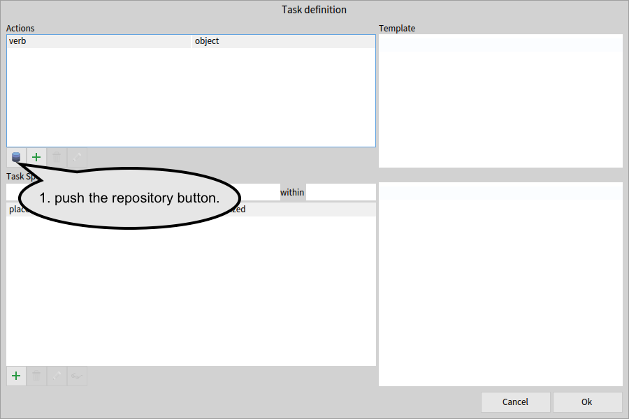
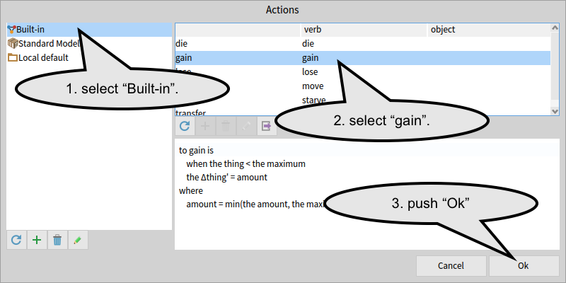

# Build a simple Grashoppers model

This tutorial guides you to build a simple model with lifehisotry stages.


## 1. Open a modeller

In the menu bar, find "re:Mobidyc" submenu to select "Modeller".


## 2. Define Cell

We want grasshoppers fly to rich grass, so in this model each cell has the amount of grass as a property.
The unit of amount could be expressed in weight (such as `kg`), height (such as `cm`), or some other units.
In this model, we consider it's nutrition and use `kcal` to measure the amount of grass.

### the grass property

Cell initially does not have any property.
We first select Cell definition page by clicking at Cell tab.
Then we add the `grass` property to Cell by pressing the green '+' button and fill `grass` and `kcal` into Add property to Cell dialog.


The Cell definition page will look as below.


### visualization

We want to visualize the amount of grass during the simulation.
The visualization can be set at the Visualization section of the Cell definition page.


Fill in `my grass` after the "with alpha =" label, and `0 [kcal]` and `100 [kcal]` into the following fields.
This visualization renders each cell with green blended with black background proportional to the cell's `grass` property.
When the grass is `0 [kcal]` the cell will look black, and `100 [kcal]` will color the cell in fully green.

## 3. Define Grasshopper and Egg as Animats

This model exhibits grasshoppers lay eggs and eggs become grasshopper when hatching.
Grasshopper and Egg are stages in lifehistory and are both modeled as Animat.

### Grasshopper animat

Selecting the green '+' tab will bring you the new animat page.


Type "Grasshopper" and then press the green "+" button on the right to create a new animat named `Grasshopper`.

### age property of Grasshopper

The `Grasshopper` tab brings you the definition page of the Grasshopper animat.
To judge maturity of grasshopper to lay eggs, we define the `age` property of the Grasshopper animat.


Pressing the green "+" button below the Property list and type `age` and `[day]` to define the age property.


### Egg animat

We also have `Egg` as an animat.
Create it on the new animat page.

### age property of Egg

Again, define the `age` property in the same way as the one in `Grasshopper` animat.


### visualization of Animats

You can choose how to visualize the animat.
Select cyan in the Visualization section at the right top part of the `Egg` definition page.


## 4. Define the "grow" task of Cell

Now we are at the very core part of the model to define the behavior of each agent.
In re:mobidyc, the behavior of an agent is defined by tasks.
A task of an agent is tyically definitions of changes to properties of the agent, the cell where the agent is on, and optionally other agents within a given range.
For example, the `grow` task is to increase the value of the `grass` attribute of a cell.

Clicking at the green "plus" button below the Task list, the task definition browser will open.



### the "gain" action

To define a new task, we take two steps: (1) select or define an action, and then (2) specialize the action by providing the context of the situation to perform the task.
An action is a generalized template of the task.
For example, we want to define a `gain` task that increases the amount of the `grass`, which can be generalized as `gain` action because the `grass` in each cell will be gained.
In the re:mobidyc, several actions, including the `gain` action`, are provided in the built-in repository.

Clicking at the left-most button with a repository icon, the repository action browser will open.
Select `built-in` in the repository list on the left, and then `gain` in the upper-right list.
The source definition will be shown below the list.



`the` denotes placeholders which will be replaced later in the definition of tasks.
This action contains three placeholders: `the thing`, `the maximum`, and `the amount`.

The line `when the thing < the maximum` declares the condition to perform this action.
If this condition is not satisfied, tasks based on this action will not be performed.

`the Δthing' = amount` defines the main effect of this action that the value of `the thing` will be increased by `amount`.
The value of `amount` is defined in the `where` clause.

### the "grow" task

The `grow` task can be defined as a specialization of the `gain` action by replacing the placeholders.
The replacement are defined in the Task specialization section.
Clicking at the green "+" button at the bottom of the Task specialization section will open the replacement dialog.


Select `the` at the first droplist, type `thing` before the left arrow, and enter `here's grass` so that the whole thing will read as `the thing -> here's grass`.
Add `the maximum -> 100 [kcal]` and `the amount -> 1 [kcal/day] * delta time`.
Please note that if you enter `delta`, the system will translate it into the `Δ` symbol.

The task definition will look as follows.


Press the "OK" button and then the Cell definition page will look as follows.


## 5. Define tasks of Grasshopper

We will define five tasks of the `Grasshopper` animat, namely `age`, `move`, `eat`, `starve`, and `lay_egg`.

### the "age" task of Grasshopper

We want to manage the maturity of a grasshopper in the `age` property.
Although it can be seen as a special case of `gain`, we define it as a user-defined action.

Select the `Grasshopper` tab and click at the green "+" button at the tasks section to open the task definition browser.
Clicking at the green "+" button below the Actions list will open an Action definition dialog.


In the position of `verb`, enter `age` which is the name of the action.
We then define the change definition on the `age` property.
Click at the green "+" button ABOVE the `where` label, and then the Property definition dialog will open.


Select `my` and Δ in the droplists, and enter `age` and `delta time`.
The `age` action will be defined as follows.


We defined the `age` action very specific to our animat, and the resulting action does not need any specialization.
We simply select the `age` action and press the `OK` button in the task definition browser.


### the "move" task

The `move` task takes a grasshopper to richer field, i.e. the cell with more `grass` property.
The re:mobidyc's built-in action repository provides the `move` action that allows you to specify the direction and the speed.
Click at the green "+" button at the task section to open the task definition browser.

First we import the `move` action from the built-in repository.
Click at the repository button at the action section to open the repository action browser, and select the built-in repository and the `move` action.


Then we specialize the `move` action to direct the grasshopper to richer field.
For `the direction`, we use `direction neighbor's grass` that gives the direction of the gradient of the `grass` attribute.
For `the speed`, we use `uniform 0 [m/day] to 500 [m/day]` that gives a random number from the uniform distribution between 0 and 500 m/day.

### the "eat" task

In this mode, the `eat` task consumes the grass in the field.
So, we can define the `eat` task using the `lose` action provided in the built-in repository.

First, select the `Grasshopper` tab and click at the green "+" button at the tasks section to open the task definition browser.
Import the `lose` action using the repository button in the action section.


Then we specialize the `lose` action into the `eat` task.
First, enter `eat` under the Task Specialization label instead of lose.
Then provide the following replacements.

```
the thing -> here's grass
the minimum -> 0 [kcal]
the amount -> 1 [kcal/day] * delta time
```

This will have a grasshopper eat the grass at the rate of 1 [kcal/day] unless the grass is below `0 [kcal]`.
The resulting task definition will look as below.


### the "starve" task

In this model, a grasshopper dies when the field has no food to eat (namely grass).                
The `starve` action is provided in the built-in repository and we can give the following replacements.

```
the vitality -> here's grass
the minimum -> 1 [kcal]
```
The resulting `starve` task will look as follows.


### the "lay_egg" task

Reproduction is not a mere change to properties but generate one or more new individuals into the simulation.
Such actions can be defined using the `new` lifehistory directive.
In this particular model, a grasshopper dies when it lay eggs.
Death can be implemented by the `die` lifehistory directive.

Select the `Grasshopper` tab and click at the green "+" button at the tasks section to open the task definition browser.
Clicking at the green "+" button below the Actions list will open an Action definition dialog.


Then press the button labelled `no directive` to choose lifehistory directives.


Check "die" and "new", and press OK.
Then you'll be asked to enter the Animat name, but leave it as it is and press OK again.


First, enter `lay_egg` at the first field to name the action.
Then, enter `my agen > 50 [day]` to specify the condition that this action should be taken.
We also need to define a property definition to reset the `age` property of the new eggs.
Click the green "+" button above the "where" label and select `new` and enter `age` and `0 [day]` to make `new age' = 0 [day]`.
Press OK to accept the new definition of the `lay_egg` task.

Then, we can specialize the `lay_egg` action so that it generates five new eggs.
Click the green "+" button at the Task specialization section to give a replacement `new - -> new 5 Egg`.
Press OK to finish the definition.


## 6. Define tasks of Egg


### the "age" task


### the "hatch" task


## 7. Set up simulation


### time

```during 1.0 year step by 1.0 day```

### Cell

```
10 x 10 of 1.0 km Cell with
  grass = uniform 0 [kcal] to 100 [kcal]
```

### Grasshopper


```
10 Grasshopper with
  x = uniform 0 [m] to 10 [km]
  y = uniform 0 [m] to 10 [km]
  age = uniform 0 [day] to 30 [day]
```


## 8. Run the simulation

