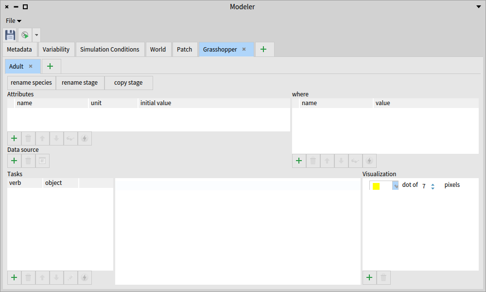
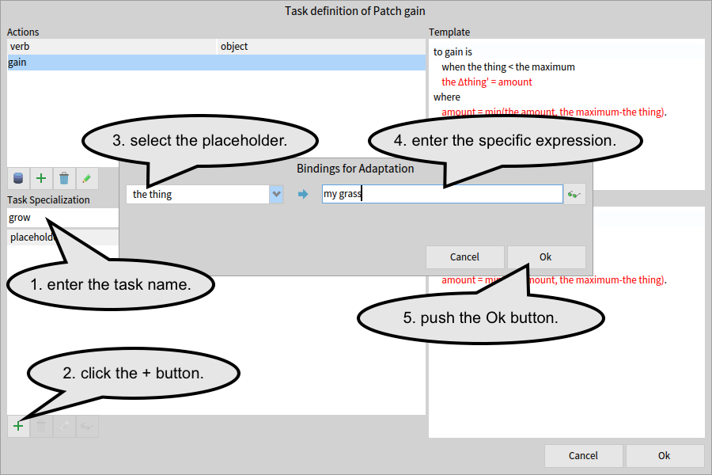

# Build a simple Grashoppers model

This tutorial guides you to build a simple model with lifehisotry stages.


## 1. Open a modeller

In the menu bar, find "re:Mobidyc" submenu to select "Modeller".


## 2. Define Cell

### the grass property


### visualization


## 3. Define Grasshopper and Egg as Animats

### Grasshopper animat


### age property of Grasshopper




### Egg animat

### age property of Egg


### visualization of Animats


## 4. Define the "grow" task of Cell


### the "gain" action


### the "grow" task




## 5. Define tasks of Grasshopper

### the "age" action


### the "age" task of Grasshopper


### the "move" task


### the "eat" task


### the "starve" task


### the "lay_egg" task


## 6. Define tasks of Egg


### the "age" task


### the "hatch" task


## 7. Set up simulation


### time

```during 1.0 year step by 1.0 day```

### Cell

```
10 x 10 of 1.0 km Cell with
  grass = uniform 0 [kcal] to 100 [kcal]
```

### Grasshopper


```
10 Grasshopper with
  x = uniform 0 [m] to 10 [km]
  y = uniform 0 [m] to 10 [km]
  age = uniform 0 [day] to 30 [day]
```


## 8. Run the simulation

